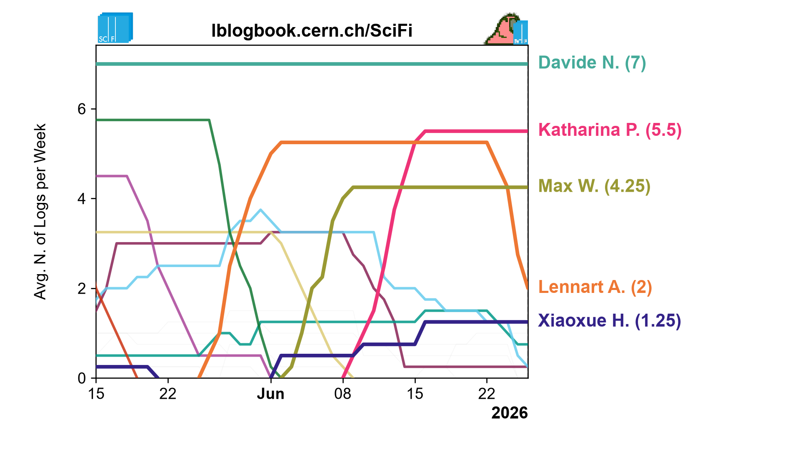

# ELOG author chart

Creates an animated MP4 showing the most active ELOG authors over time. The input is an XML export from ELOG; the generated files are `top5_authors_zoom.mp4` and `top5_authors_zoom_frame.png`.


## Export the input from ELOG

1. Open the relevant logbook and select **Find**.
2. Set the date range and any attribute or text filters. Multiple fields are combined, so an entry must match every supplied criterion. For the whole logbook, leave the filters empty and select an unrestricted time range if **Show last** is enabled.
3. Under **Export to**, select **XML**, then run the search.
4. Save the downloaded file as `data/export.xml`.

ELOG installations can customize or hide menu commands, so ask the logbook administrator if **Find** or XML export is unavailable. See the official [ELOG User's Guide](https://elog.psi.ch/elog/userguide.html#browsing-around-and-finding-things) for search behavior.

## Run

Install the runtime dependencies, then run the renderer:

```powershell
python -m pip install polars numpy matplotlib imageio-ffmpeg
```

```powershell
python top_authors_anim.py
```

Optionally pass the number of rendering workers:

```powershell
python top_authors_anim.py 4
```

## Main parameters

Edit the **Tunables** section near the top of `top_authors_anim.py`:

| Parameter | Purpose |
| --- | --- |
| `START_DATE`, `END_DATE` | Optional inclusive UTC bounds in `YYYY-MM-DD` format. Use `None` for the first or last available entry. |
| `TITLE` | Chart title and MP4 metadata title. |
| `INCLUDE_LOGO`, `INCLUDE_PARROT` | Enable or disable each header asset independently. |
| `WINDOW_WEEKS` | Trailing window used to calculate each author's average weekly activity. |
| `TOP_N` | Number of authors highlighted and labelled. |
| `VIEW_WEEKS` | Width of the moving time viewport. |
| `WEEKS_PER_SECOND` | Playback speed in data weeks per video second. |
| `FPS` | Output frame rate. |
| `END_HOLD_SECONDS` | Duration of the final frozen frame. |
| `DPI`, `FIGURE_SIZE` | Output resolution; the defaults produce 1920 x 1080. |
| `VIDEO_CRF` | H.264 quality/size tradeoff; higher values produce smaller files. |
| `N_WORKERS`, `VIDEO_THREADS` | Parallel rendering and encoder CPU usage. The command-line worker count overrides `N_WORKERS`. |
| `EXPORT_PATH`, `LOGO_PATH`, `PARROT_PATH` | Input XML and optional header asset locations. |

Keep `SAMPLES_PER_WEEK = 7`: the chart data is sampled daily, and this value is used for playback and easing calculations.
